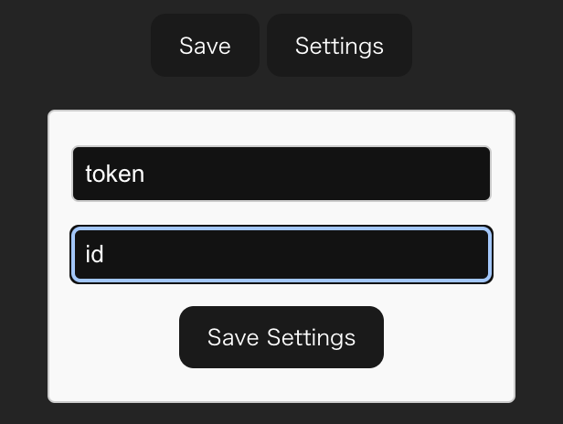

# p2n: Paper to Notion

This is a simple chrome extension that allows you to save papers to Notion.

## Usage

1. Find the DOI of the paper you want to save.
2. Click the extension icon.
3. Copy & Paste DOI to the input field.
4. Click the "Save" button.

## Preparation

Create Notion Database which has the following properties:

| Title    | Authors      | Year  | Journal | Volume | DOI  | PDF (optional)  |
|----------|--------------|-------|---------|--------|------|------|
| Text     | Multi-select | Number| Select  | Number | URL  | File |

Create an integration for this app and get the token value.

Input the token and the [database ID](https://developers.notion.com/reference/retrieve-a-database) to the extension options.

Pless the "Save Settings" button after you input the values.

## Development

1. Clone this repository.
2. Run `npm install`.
3. Run `npm run dev` to start the development server.
